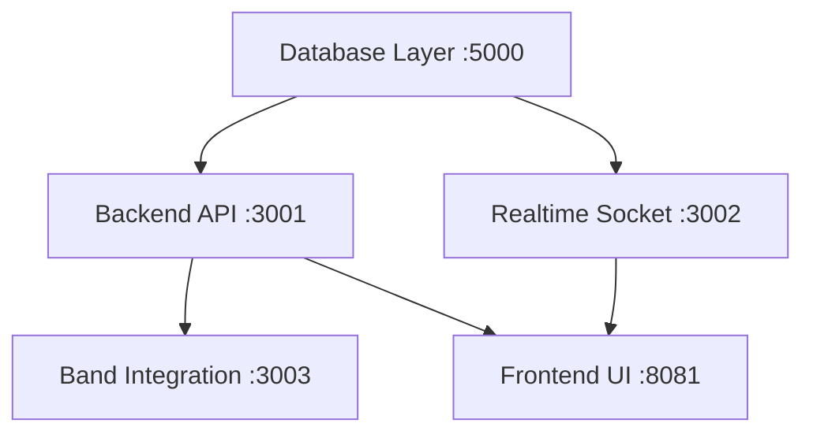

# 🚀 YameYame AutoRun 시스템

YameYame 프로젝트의 모든 서비스를 한 번에 시작하고 관리할 수 있는 자동화 시스템입니다.

## ✨ 주요 기능

- **🎯 원클릭 시작**: `npm run autorun`으로 모든 서비스 자동 실행
- **📊 의존성 관리**: 서비스 간 의존성을 고려한 순차 실행
- **🏥 헬스체크**: 각 서비스의 실시간 상태 모니터링
- **🛡️ 에러 복구**: 실패 시 자동 롤백 및 정리
- **📱 실시간 상태**: 시각적 상태 표시 및 관리 명령어

## 🏗️ 서비스 아키텍처



### 서비스 시작 순서

1. **Database Layer** (포트 5000) - PostgreSQL + Prisma + Redis
2. **Backend API** (포트 3001) - REST API 서버
3. **Realtime Socket** (포트 3002) - WebSocket 실시간 통신
4. **Band Integration** (포트 3003) - 네이버 밴드 OAuth 연동
5. **Frontend UI** (포트 8081) - React Native Expo 앱

## 🚀 사용법

### 전체 환경 시작
```bash
npm run autorun
```

### 개별 서비스 관리
```bash
# 현재 상태 확인
npm run dev:status

# 헬스체크 실행
npm run dev:health

# 전체 서비스 정지
npm run autorun:stop
```

### 기존 개발 명령어
```bash
# 기본 개발 모드 (backend + frontend만)
npm run dev

# 개별 서비스 실행
npm run backend
npm run frontend

# 기타 명령어
npm run dev:stop
npm run setup    # 워크트리 설정
npm run clean    # 캐시 정리
```

## 📊 모니터링 및 디버깅

### AutoRun 전용 상태 확인
```bash
# AutoRun 환경 상태
powershell ./dev-workflow.ps1 -Action autorun-status

# 상세 로그 모드
powershell ./dev-workflow.ps1 -Action autorun -Verbose
```

### 서비스별 헬스체크 URL

| 서비스 | 헬스체크 URL | 목적 |
|--------|-------------|------|
| Database Layer | http://localhost:5000/health | DB/Redis 연결 상태 |
| Backend API | http://localhost:3001/api/health | API 서버 상태 |
| Realtime Socket | http://localhost:3002/health | Socket 서버 상태 |
| Band Integration | http://localhost:3003/health | OAuth 서비스 상태 |
| Frontend UI | http://localhost:8081/status | Metro bundler 상태 |

## 🔧 설정 및 커스터마이징

### 포트 변경
`dev-workflow.ps1`의 `$ServiceConfig` 섹션에서 각 서비스의 포트를 수정할 수 있습니다:

```powershell
$ServiceConfig = @{
    "database-layer" = @{
        Port = 5000  # 변경 가능
        HealthUrl = "http://localhost:5000/health"
        StartupTime = 8  # 시작 대기 시간 (초)
        Command = "cd worktrees/database-layer; npm run dev"
        Dependencies = @()  # 의존성 서비스
    }
    # ... 기타 서비스 설정
}
```

### 의존성 수정
각 서비스의 `Dependencies` 배열을 수정하여 시작 순서를 조정할 수 있습니다.

### 헬스체크 타임아웃 조정
`Test-ServiceHealth` 함수의 `$MaxRetries` 값으로 재시도 횟수를 조정합니다.

## ❗ 트러블슈팅

### 자주 발생하는 문제

#### 1. 포트 충돌
```bash
# 기존 프로세스 확인 및 종료
netstat -ano | findstr :3001
taskkill /PID <PID번호> /F
```

#### 2. 서비스 시작 실패
```bash
# 개별 서비스 수동 확인
cd worktrees/backend-api
npm run dev

# 의존성 설치 확인
npm install
```

#### 3. 헬스체크 실패
- PostgreSQL 서버 실행 확인
- Redis 서버 실행 확인
- 방화벽/백신 소프트웨어 확인

#### 4. AutoRun 정지되지 않음
```bash
# 강제 종료
powershell ./dev-workflow.ps1 -Action clean
```

### 로그 및 디버깅

#### 상세 로그 활성화
```bash
powershell ./dev-workflow.ps1 -Action autorun -Verbose
```

#### 개별 서비스 로그
각 서비스는 별도 PowerShell 창에서 실행되므로 해당 창에서 로그를 확인할 수 있습니다.

## 🔄 업데이트 및 유지보수

### 새 서비스 추가
1. `dev-workflow.ps1`의 `$ServiceConfig`에 새 서비스 추가
2. `$serviceOrder` 배열에 서비스명 추가
3. 헬스체크 엔드포인트 구현

### 설정 백업
중요한 설정 변경 전에는 `dev-workflow.ps1` 파일을 백업해주세요.

## 🎯 성능 최적화

### 시작 시간 단축
- 각 서비스의 `StartupTime` 값을 최소화
- SSD 사용 권장
- 불필요한 백그라운드 프로그램 종료

### 리소스 관리
- Node.js 메모리 제한 설정: `--max-old-space-size=4096`
- CPU 코어 수에 따른 동시 실행 제한

## 📞 지원 및 기여

문제가 발생하거나 개선 아이디어가 있으시면:
1. GitHub Issues 등록
2. 개발팀 문의
3. 커뮤니티 포럼 활용

---

**🏸 Happy Coding with YameYame! 🏸**