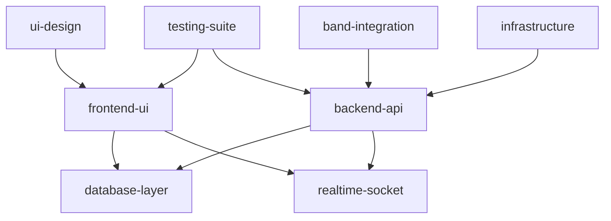

# 🚀 YameYame 개발 킥오프 계획

## 📋 개발 환경 검증 완료 ✅

### 🔧 시스템 준비 상태
- **Node.js**: v24.4.1 ✅
- **npm**: v11.4.2 ✅ 
- **Expo**: 53.0.20 (npx) ✅
- **Git Worktrees**: 8개 브랜치 준비 완료 ✅
- **프로젝트 구조**: Monorepo 설정 완료 ✅

### 📁 워크트리 상태
```
✅ backend-api        - TypeScript/Express 서버 (의존성 설치 필요)
✅ frontend-ui        - React Native/Expo 앱 (의존성 설치 필요)
✅ band-integration   - OAuth & API 연동
✅ database-layer     - MongoDB/SQLite 스키마
✅ realtime-socket    - Socket.io 실시간 통신
✅ testing-suite      - Jest/Detox 테스트
✅ infrastructure     - Docker/AWS 배포
✅ ui-design          - 체육관 특화 디자인
```

## 🎯 Phase 1: High Priority 이슈 해결 (Week 1-2)

### 🔥 Critical Tasks - 즉시 시작

#### Task 1: 체육관 현장 특화 UI 기초 구현
**담당**: `frontend-ui` + `ui-design` 워크트리
**우선순위**: 🔴 Critical
**예상 기간**: 3-4일

```yaml
목표:
  - 큰 터치 영역 (최소 44x44pt) 구현
  - 고대비 컬러 시스템 적용
  - 체육관 조명 환경 최적화
  - 간편한 네비게이션 구조

구체적 작업:
  - Material Design + 체육관 특화 테마 생성
  - TouchableOpacity 최소 크기 강제 설정
  - 고대비 색상표 (대비비 7:1 이상)
  - 큰 폰트 크기 (최소 16sp)
  - 간격 여유롭게 (최소 8dp)
```

#### Task 2: 오프라인 우선 아키텍처 설계
**담당**: `database-layer` + `backend-api` 워크트리  
**우선순위**: 🔴 Critical
**예상 기간**: 4-5일

```yaml
목표:
  - SQLite 오프라인 저장소 구현
  - 동기화 큐 시스템 설계
  - 충돌 해결 전략 구현
  - 네트워크 상태 감지

구체적 작업:
  - React Native SQLite 통합
  - 동기화 큐 테이블 설계
  - 백그라운드 sync 작업자
  - 충돌 해결 알고리즘 (Last-Write-Wins + Version Vector)
  - Network Info API 통합
```

#### Task 3: 배터리 효율적 Socket 관리
**담당**: `realtime-socket` + `frontend-ui` 워크트리
**우선순위**: 🔴 Critical  
**예상 기간**: 3-4일

```yaml
목표:
  - 지능적 연결 관리
  - 백그라운드 최적화
  - 배터리 절약 모드
  - 재연결 전략

구체적 작업:
  - Socket.io Heartbeat 최적화 (30s → 60s)
  - 앱 백그라운드 시 연결 일시정지
  - 화면 활성 상태 감지
  - 지수적 백오프 재연결
  - 배터리 상태 기반 연결 조절
```

#### Task 4: 기본 E2E 테스트 환경
**담당**: `testing-suite` 워크트리
**우선순위**: 🟡 High
**예상 기간**: 2-3일

```yaml
목표:
  - Detox 기본 설정
  - 핵심 사용자 여정 테스트
  - CI/CD 파이프라인 연동
  - 기본 성능 테스트

구체적 작업:
  - Detox + Jest 환경 설정
  - 로그인 → 홈 → 게임등록 E2E 시나리오
  - GitHub Actions 연동
  - 기본 성능 메트릭 (앱 시작 시간, 메모리)
```

#### Task 5: 성능 모니터링 기초
**담당**: `infrastructure` + `backend-api` 워크트리
**우선순위**: 🟡 High
**예상 기간**: 2-3일

```yaml
목표:
  - 기본 메트릭 수집
  - 성능 임계값 설정
  - 알림 시스템 구축
  - 대시보드 구성

구체적 작업:
  - Winston 로깅 시스템
  - Express 성능 미들웨어
  - React Native Performance Monitor
  - 기본 Grafana 대시보드
  - Slack 알림 연동
```

## 📅 첫 주 일정 (Day-by-Day)

### 월요일 (Day 1)
```bash
AM: 의존성 설치 및 환경 설정
- npm install in all worktrees
- 환경 변수 파일 생성
- 데이터베이스 연결 테스트

PM: UI 기초 작업 시작
- 체육관 특화 테마 생성
- 기본 네비게이션 구조
```

### 화요일 (Day 2)
```bash
AM: 오프라인 아키텍처 설계
- SQLite 스키마 설계
- 동기화 전략 문서화

PM: Socket 연결 최적화
- 기본 Socket.io 설정
- 연결 관리 로직 구현
```

### 수요일 (Day 3)  
```bash
AM: 테스트 환경 구축
- Detox 설정 및 첫 테스트

PM: 성능 모니터링 설정
- 로깅 시스템 구축
- 기본 메트릭 수집
```

### 목요일 (Day 4)
```bash
AM: 통합 테스트
- 워크트리 간 통합 확인
- 기본 기능 동작 검증

PM: 문제 해결 및 최적화
- 발견된 이슈 해결
- 성능 튜닝
```

### 금요일 (Day 5)
```bash
AM: 코드 리뷰 및 품질 검증
- PR 생성 및 리뷰
- 테스트 커버리지 확인

PM: 다음 주 계획 수립
- Sprint 2 계획 구체화
- 블로커 사전 식별
```

## 🔄 병렬 개발 전략

### 워크트리별 담당자 및 의존성



### 의존성 관리
1. **database-layer** 먼저 완성 (다른 워크트리 의존)
2. **ui-design** + **frontend-ui** 병렬 진행
3. **backend-api** + **realtime-socket** 병렬 진행  
4. **testing-suite** 지속적 통합
5. **infrastructure** 배포 준비

## 📊 성공 지표 및 체크포인트

### Week 1 목표
- [ ] 체육관 특화 UI 테마 적용 완료
- [ ] SQLite 오프라인 저장소 기본 동작
- [ ] Socket 연결 배터리 최적화 검증
- [ ] E2E 테스트 1개 시나리오 통과
- [ ] 기본 성능 메트릭 수집 시작

### 품질 게이트
```yaml
UI/UX:
  - 터치 영역 최소 44pt 검증
  - 색상 대비비 7:1 이상 확인
  - 체육관 환경 테스트 완료

Performance:
  - 앱 시작 시간 < 3초
  - 메모리 사용량 < 150MB  
  - Socket 연결 시간 < 2초

Quality:
  - 테스트 커버리지 > 80%
  - ESLint/TSLint 오류 0개
  - E2E 테스트 통과율 100%
```

## 🛠️ 개발 도구 및 프로세스

### 일일 스탠드업 체크리스트
```bash
1. 어제 완료한 작업
2. 오늘 계획한 작업  
3. 블로커 또는 도움 필요 사항
4. 다른 팀과의 의존성 이슈
5. 품질 게이트 통과 여부
```

### 코드 리뷰 프로세스
```bash
1. 기능 완료 후 PR 생성
2. 자동 테스트 실행 및 통과
3. 코드 품질 도구 검증
4. 팀원 리뷰 (최소 1명)
5. 승인 후 메인 브랜치 병합
```

### 통합 일정
```bash
- 매일 오후 4시: 워크트리별 진행 상황 공유
- 매일 오후 5시: 통합 테스트 실행  
- 격일 오전 9시: 전체 팀 스탠드업
- 매주 금요일: Sprint 회고 및 계획
```

## 🚨 리스크 관리

### 주요 리스크
1. **의존성 충돌**: 워크트리 간 버전 불일치
2. **성능 저하**: SQLite 동기화 오버헤드
3. **배터리 소모**: Socket 연결 최적화 실패
4. **통합 복잡성**: 8개 워크트리 조율 난이도

### 완화 전략
1. **Lock 파일 통합**: 모든 워크트리 의존성 버전 고정
2. **성능 벤치마크**: 각 기능별 성능 임계값 설정
3. **배터리 테스트**: 실제 디바이스 장시간 테스트
4. **통합 자동화**: CI/CD 파이프라인으로 자동 검증

## 📞 즉시 실행 명령어

### 개발 환경 설정
```bash
# 모든 워크트리 의존성 설치
cd "C:\Users\taejo\yameyame"
npm run setup

# 개발 서버 시작 (모든 워크트리)
npm run dev
```

### Phase 1 태스크 시작
```bash
# Claude Squad 병렬 개발 시작
npm run claude-squad

# 또는 개별 워크트리 작업
cd worktrees/frontend-ui && npm run dev
cd worktrees/backend-api && npm run dev
```

이제 체계적으로 개발을 시작할 준비가 완료되었습니다! 🚀